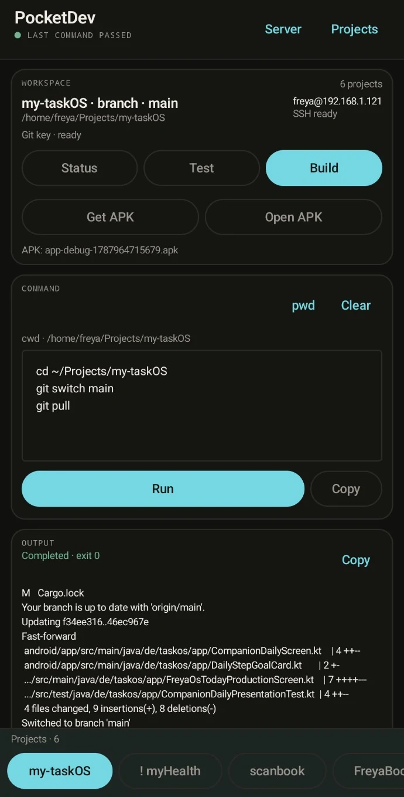

# PocketDev

PocketDev is a mobile-first Android control surface for a remote development server. It is designed for common development workflows from a phone without trying to turn the phone into a full IDE.

PocketDev connects directly to an existing development machine over SSH. It can manage multiple projects, run remote commands with streaming output, keep long-running work alive in the background, retrieve and install APK artifacts, transfer files between phone and server, and prepare a reviewable GitHub issue draft from failed commands.

<p align="center">
  
</p>

## Why PocketDev

PocketDev is useful when the real development environment already lives on a workstation or server, but you want to handle routine development loops from a phone: pull, test, build, inspect failures, retrieve an APK, move a file, or stop a command without opening a laptop or using a general-purpose mobile SSH client.

The project deliberately stays a control surface rather than becoming a miniature IDE. Source editing and heavy development tooling remain on the remote machine.

## Current state

PocketDev 1.x is functionally complete for its intended core workflow and is maintained through issues found during normal use. Historical sprint plans are kept under `docs/` for context; they are not the current roadmap.

## Main capabilities

- pinned-host SSH connection with stored credentials;
- multiple saved remote projects and fast project switching;
- remembered working directory and current Git branch display;
- predefined Pull / Test / Build actions plus arbitrary multi-line commands;
- streaming stdout/stderr, exit status, Copy, Stop/Ctrl-C and interactive sudo handling;
- persistent remote `ssh-agent` support for GitHub SSH keys;
- automatic project bootstrap for missing remote folders;
- SHA-256-verified APK retrieval and Android package installation;
- retry and foreground keep-alive protection for APK/file transfers;
- project-independent Files page with selectable phone/server transfer directories and two-way multi-file transfer;
- reviewable `Git Issue` diagnostic flow after failed commands.

## Requirements

- JDK 17
- Android SDK with API 37 available
- Android device or emulator for installation/device testing

The Gradle wrapper is checked into the repository, so no global Gradle installation is required.

## Build and test

```bash
./gradlew testDebugUnitTest assembleDebug
```

For the clean unsigned release path used for F-Droid readiness checks:

```bash
./gradlew clean testDebugUnitTest assembleRelease
```

The debug APK is written to:

```text
app/build/outputs/apk/debug/app-debug.apk
```

Install it with:

```bash
adb install -r --user 0 app/build/outputs/apk/debug/app-debug.apk
```

## F-Droid

PocketDev is prepared for submission to the official F-Droid repository. Store metadata is kept under `fastlane/metadata/android/`, and `fdroid/de.fgna.pocketdev.yml` contains the packaging template for the external `fdroiddata` merge request. See `docs/fdroid.md` for the readiness checklist and submission workflow.

## Architecture

```text
Jetpack Compose UI
        |
PocketDev state / project model
        |
SSH execution + artifact/file-transfer abstractions
        |
SSHJ
        |
Existing development server
```

PocketDev deliberately uses direct SSH and does not require a custom server daemon. Project-specific commands and paths stay separate from the SSH transport layer.

## Security model

PocketDev assumes the SSH server is infrastructure you already control. It is not a service for exposing a development machine directly to the public internet.

- SSH host keys are pinned; host verification must not be disabled.
- Credentials and private keys must never be logged or committed.
- Stored authentication secrets use Android-side protected storage rather than ordinary plaintext preferences.
- Diagnostic/GitHub flows remain reviewable; PocketDev does not silently upload source, diffs, credentials or arbitrary logs.
- APK installation requires the downloaded file to match the server-side SHA-256 digest.

## Documentation

- `AGENTS.md` — product/architecture guidance for repository work.
- `docs/README.md` — documentation index and historical sprint status.
- `docs/apk-signing.md` — APK signing notes.
- `docs/fdroid.md` — F-Droid readiness and submission workflow.
- `docs/git-key-agent.md` — persistent Git SSH-agent behavior.
- `docs/user-testing-apk-installer.md` — APK installer test notes.

## License

PocketDev is available under the Apache License 2.0. See `LICENSE`.
